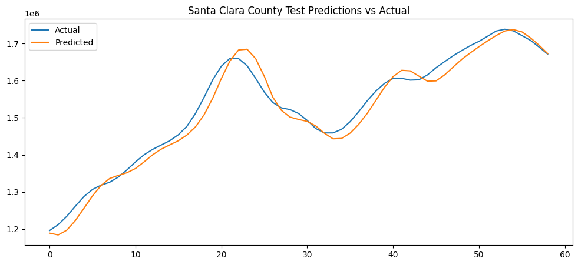
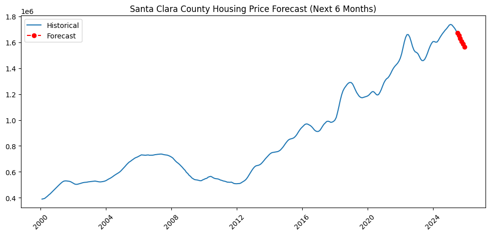
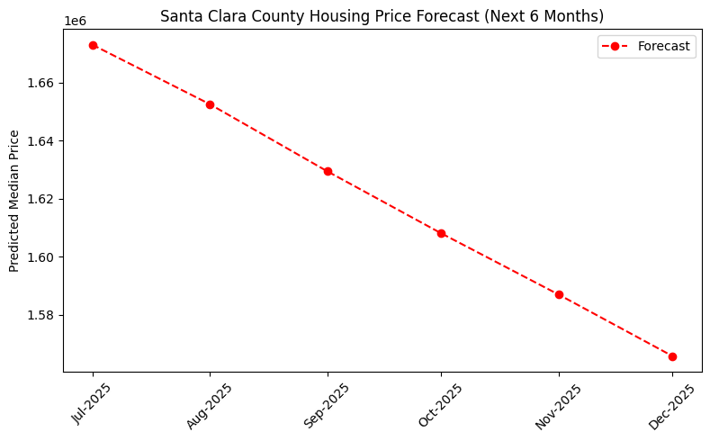

# 🏡 State & County Housing Price Forecast

This project provides historical visualization and 6-month forecasts of housing prices for U.S. states and counties using Zillow ZHVI (Zillow Home Value Index) data.
The app is built with Python, TensorFlow, and Streamlit, allowing interactive exploration by state and county.

## Features

-Select a State and County from dropdowns
-Historical price chart for the selected county
-6-month forecast chart with predicted Zillow ZHVI
-Clean X-axis labels like July-2025, August-2025, etc.
-Interactive Streamlit app with loading indicator while the model trains
-Tabular display of predicted prices for next 6 months

## Folder Structure
```
  housing-forecast/
  ├─ app.py                  # Streamlit app
  ├─ notebook/               # Optional Jupyter notebooks
  │  └─ state_county_forecast.ipynb
  ├─ data/                   # Place your CSV files here (ignored by git)
  │  └─ County_ZHVI_AllHomes.csv
  ├─ requirements.txt
  ├─ README.md
  └─ .gitignore
```
## Setup & Installation

### 1. Clone this repository
git clone https://github.com/<YOUR_USERNAME>/housing-forecast.git
cd housing-forecast
### 2. Create a virtual environment (recommended)
python -m venv .venv
#### Activate on Windows
.venv\Scripts\activate
#### Activate on macOS/Linux
source .venv/bin/activate
### 3. Install dependencies
pip install -r requirements.txt
### 4. Download Zillow County-level ZHVI data
- Go to Zillow Research Data
- Download the County ZHVI All Homes CSV
- Place it in the data/ folder as:
data/zillow_county.csv

## Run the Streamlit App
streamlit run app.py

## How it Works

1.Data Preprocessing

- Converts monthly ZHVI columns (YYYY-MM) into a time series
- Handles missing values

2.Lagged Features

- Uses previous 12 months as input features to predict next month

3.TensorFlow Model

- Simple feedforward neural network
- Two hidden layers (64 → 32 neurons) with ReLU activation
- Trained on 80% of historical data

4.Forecast

- Predicts next 6 months sequentially
- Updates sliding window for each prediction

5.Visualization

- Chart 1: Historical time series
- Chart 2: Forecast with X-axis formatted as Month-Year
- Tabular display of predicted values

## Customization

- Change lag window: LAGS = 12 in app.py
- Change forecast horizon: FORECAST_MONTHS = 6
- Select different states/counties in dropdowns
- Change model structure: adjust layers in forecast_series()

## License

This project is licensed under MIT License. Feel free to use, modify, and share.

## Screenshots





